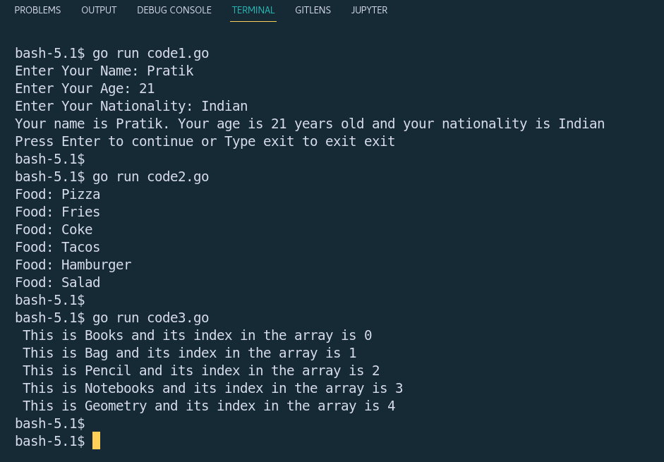

## Go Task-1

### _Problem Statement_
```
1. Write a loop to ask the name , age and nationality from a user and print "Your name is ___  your age is ___ years old and your nationality is __"
    i. This should be infinite loop

2. Define the following array "Menu"
    i. Append to it the following item: "hamburger"
    ii. Append to it the following item: "salad"
    iii. Iterate over the list and print for each item Food: <Food name>. Make sure to replace <Food name> with item from the array

3. Define an array of 5 items
    i.Iterate over it and print for each item the following: This is <ITEM> and its index in the array is <INDEX>
```

### How to run files
To run the code use - `go run <filename>`

### Code 1 - (code1.go)
- Time Complexity Analysis - `O(n)`
- Space Complexity Analysis - `O(1) or Constant`

### Code 2 - (code2.go)
- Time Complexity Analysis - `O(n)`
- Space Complexity Analysis - `O(n)`
- Code Explaination

    - `Menu := []string{"Pizza", "Fries", "Coke", "Tacos"}` -> Declares a slice (dynamic array) named Menu with few intial items.

    - `Menu = append(Menu, "Hamburger", "Salad")` -> Appends the required items to the slice Menu

    - `for _, n := range Menu{...}` -> Loops through the slice Menu

### Code 2 - (code3.go)
- Time Complexity Analysis - `O(n)`
- Space Complexity Analysis - `O(n)`
- Code Explaination

    - `arr := [...]string{"Books", "Bag", "Pencil", "Notebooks", "Geometry"}` -> Declares a fixed size array with the initial items of type string

    - `for idx, n := range arr{...}` -> Loops through the array with index and the element

### Output
