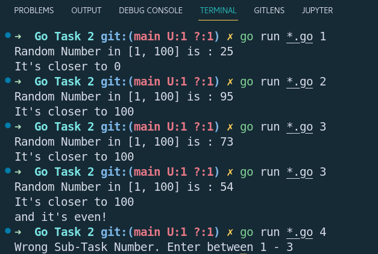

## Go Task-1

### _Problem Statement_
```
1. Generate a random number between 1 and 100
    If the number is higher than 50 print "It's closer to 100"
    If the number is lower than 50 print "It's closer to 0"
    Print the generated random number

2. Modify the previous code to print "It's 50!" if the random number is 50

3. Modify the conditional in the code you previously wrote to check not only if the  number is higher than 50 but also if it's even. If it's even and higher than 50, print,"It's closer to 100 and it's even!"
```

### How to run files
To run the code use - `go run .*go <num>` in the main directory itself, where `<num>` is subtask number(1-3).

### Project Structure Analysis
1. `main.go` - The main exectable file. It executes the required subtask using the arguments recieved from command line.
2. `helper.go` - Contains all the subtasks of the problem statement as separate files.
3. `random/random.go` - Logic to generate random number

### math/rand vs crypto/rand
Generation a random number in Golang can be done via 2 packages - `math/rand` and `crypto/rand`. 

- `math/rand` implements a large selection of pseudo-random number generators. It means only provides pseudo-random numbers, as a function of the seed. We have to set the seed every-time when we want to generate the number. 

- So if we create two Rand instances using a functionally equivalent seed, equivalent calls (in order and function) to the two instances will produce parallel outputs.

- `crypto/rand` implements a cryptographically secure pseudo-random number generator with a limited interface. The tradeoff lies in the time for larg random number generation.


### Output


