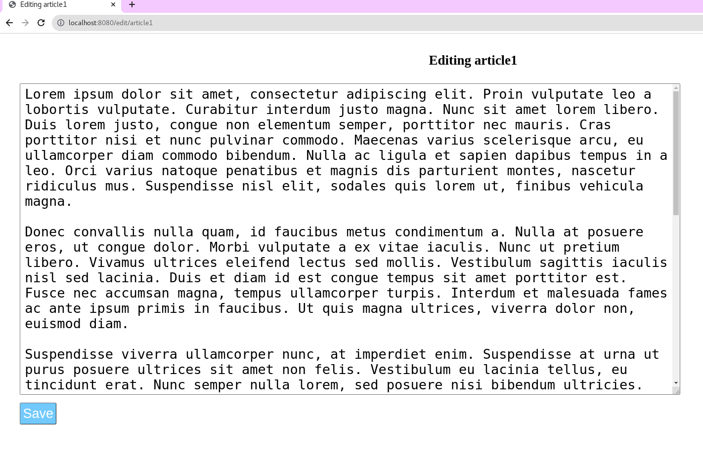

## Go Task-3

### _Problem Statement_
```
Build a simple web server in go. Use your creativity to enhance it.
```

### How to run files
To run the code use - `go run .*go` in the main directory. This creates a executable binary file
Run the binary file using `./<filename>`

### Project Structure Analysis
1. `main.go` - The main exectable file. It initializes the routes and starts the server.
2. `handlers.go` - Contains all the handlers for the routes
3. `helpers.go` - Helper functions used in handlers
4. `data/` - Stores the articles as files
4. `templates/` - Contains HTML files

### Output




