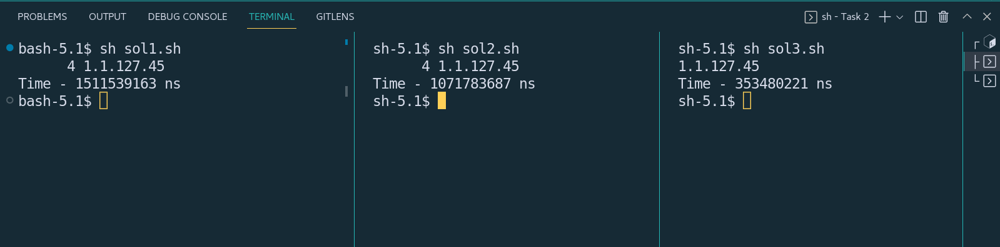

## Task-2

### _Problem Statement_
```
You will be given a file with a list of IP addresses called ip_list. 
Using the file, determine which IP address is the most recurring (listed the most times)
```

### Solution 1 - Bash - cat + sort + uniq (sol1.sh)
- How to run : `sh sol1.sh`

### Solution 2 - Bash - sort(parallel) + uniq (sol2.py)
- How to run : `sh sol2.sh`

### Solution 3 - Bash - awk (sol3.py)
- How to run : `sh sol3.sh`


### Execution Time Analysis
Steps : 
  1. For each of the files, we take the current EPOCH time as `start` in nanoseconds
  2. The logic of the solution is executed.
  3. After execution, we take the EPOCH time as `end` in nanoseconds
  4. The difference i.e `end - start` is the execution time of the program.  
  5. We measure the performance on a very large file having large number of IPs - book.txt

Results
  1. solution 1 has the highest execution time for the large file
  2. Solution 2 comes around 0.4s faster than Solution 1
  3. Solution 3 is fastest at around 5x faster than Solution 1

